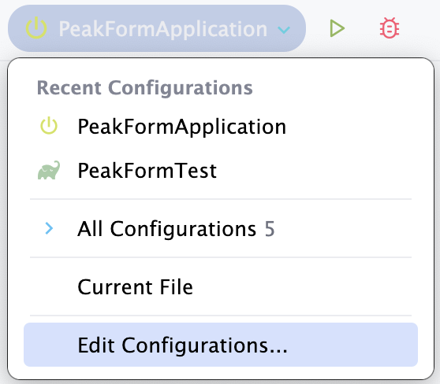
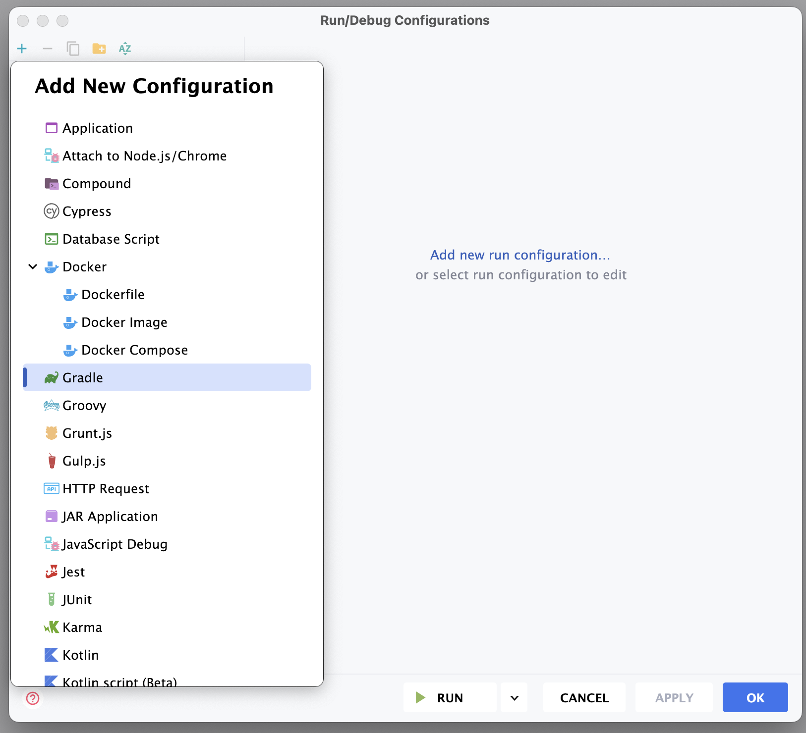
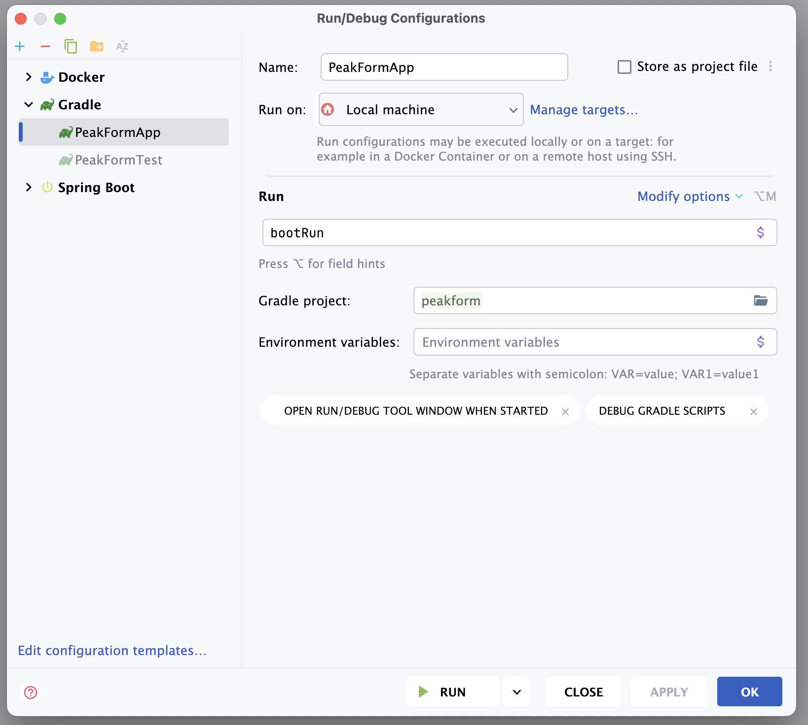

# How to Run the Project Backend

## Prerequisites

- Docker must be installed on your system.

## Running via CLI

### Start

- Open a terminal at the backend root directory.

- Run the following command:

  ```bash
  ./gradlew bootRun
  ```

### Stop

- Press `Ctrl + C` in the terminal to stop the server.

## Running via IntelliJ IDEA GUI

### Start

1. Click **Edit Configurations...**

   

2. Add a new Gradle configuration.

   

3. Fill in the required fields as shown, then click **Apply**.

   

4. Click the **Run** button to start the backend.

### Stop

- Click the **Stop** button in IntelliJ IDEA.

## Docker Cleanup (Manual for Now)

To clean up Docker containers after stopping the backend (temporary manual step):

- Open a terminal at the backend root directory.
- Run the following command:

  ```bash
  docker compose down
  ```

---

_Last updated: 13 April, 17:45 PM by Hok Layheng_