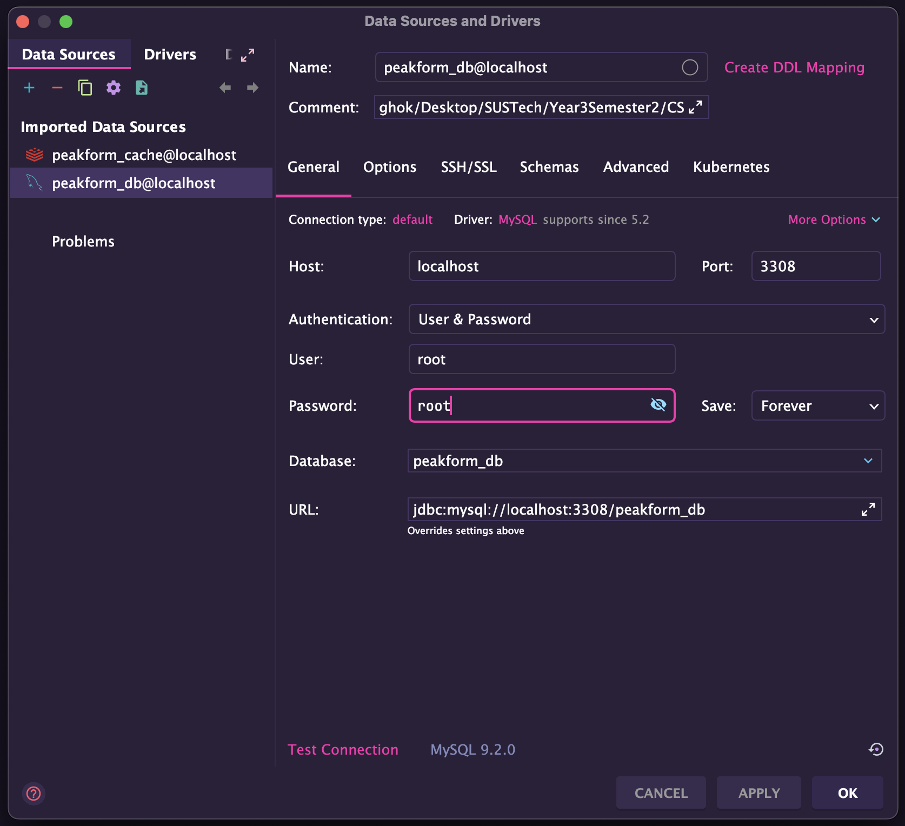

# How to Run the Project Backend

## Prerequisites

- Ensure Docker is installed on your system.
- Clone the latest code from the `main` branch to your local repository.

## Initial Setup (First Time Only)

1. Navigate to the backend project root directory:

   ```bash
   cd /path/to/peakform
   ```

2. Execute the following commands:

   ```bash
   rm -rf ./cache
   chmod +x init-db.sh
   chmod +x build.sh
   ```

3. Configure the database connection as shown in the screenshot below:
   

## Running the Project

Execute the following command to build and run the project:

```bash
./build.sh
```

## Terminating the Project

- Press `Ctrl + C` in the terminal to stop the process.
- Optionally, bring down the containers completely:

  ```bash
  docker compose down
  ```

------

**Last updated**: April 29, 2025, 22:45 by Hok Layheng