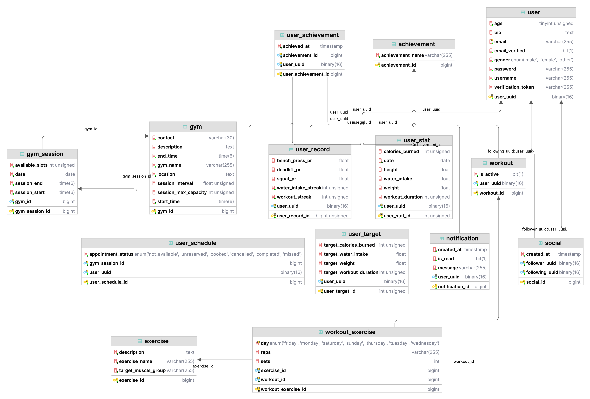
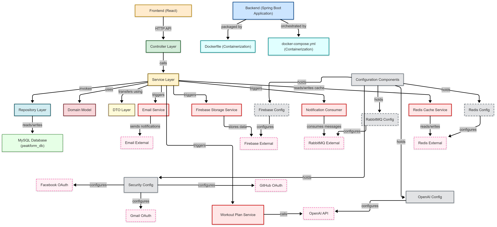
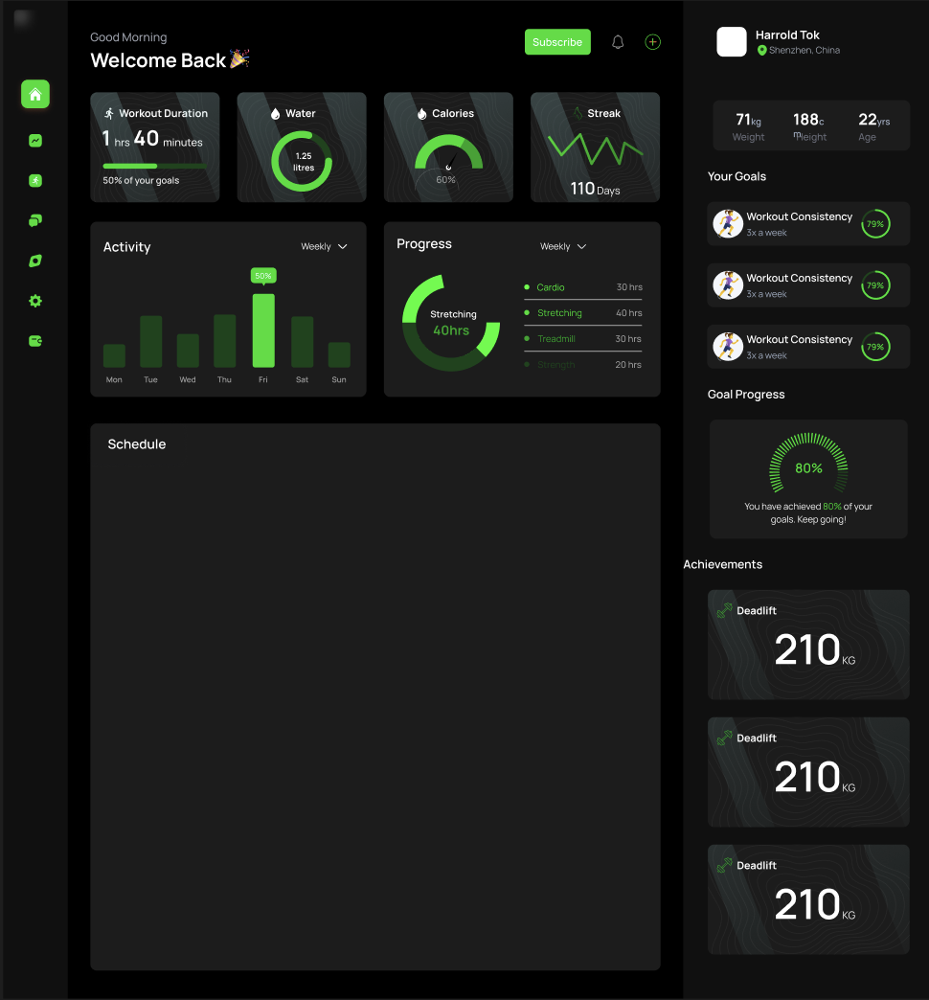
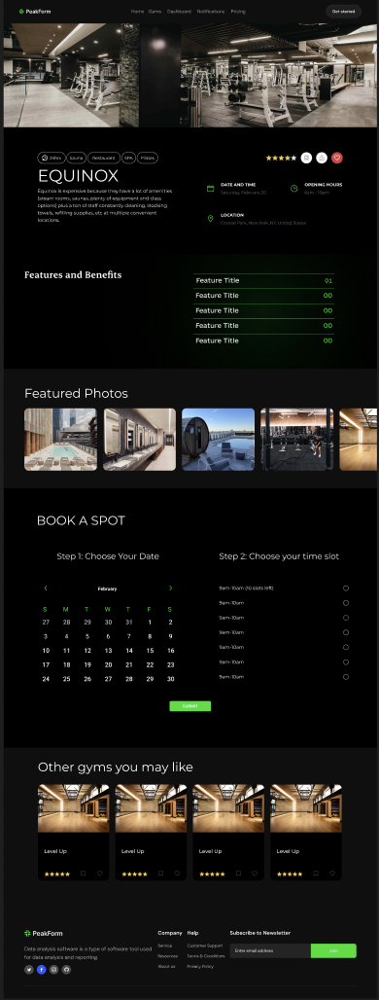

# CS304: Software Engineering - Sprint 1 Report

## Team Information

- **Team Number**: 86
- **Team Members**:
  1. Jaouhara Zerhouni Khal (12211456)
  2. Hok Layheng (12210736)
  3. Tan Hao Yang (12212027)
  4. Harrold Tok Kwan Hang (122102025)

## Sprint 1 Overview

This report outlines the work completed during **Sprint 1** of our team project. The goal of Sprint 1 is to establish a solid foundation for the system's architecture and the primary user interfaces, setting up the groundwork for the project's development. This documentation covers the system's architecture, detailing its components and interactions, as well as the UI design for the primary user interfaces, which will serve as the basis for future enhancements in Sprint 2.

##  I. Architectural Design

### 1. Database Design

- **Database Design Diagram**:  
  Below is the database design diagram of our system, illustrating the relationships between various entities in the database.

    

- **Description**:  
  The architecture of the system is designed to handle various aspects of a fitness application, focusing on managing users, workouts, gym sessions, achievements, and other fitness-related data. The key components of the system include:

  - **achievement**: Stores predefined fitness achievements that users can unlock through progress or milestones.
    
    - **exercise**: Contains a list of exercises, including their name, category, and description.
    - **gym**: Represents individual gym locations, including details like name, address, and facilities.
    - **gym_session**: Tracks user bookings and attendance for scheduled gym sessions at specific times.
    - **notification**: Stores system-generated notifications to be sent to users (e.g., reminders, updates).
    - **social**: Manages social interactions between users, such as followers, friends, or shared activities.
    - **user**: Holds account credentials and personal information for all users of the system.
    - **user_achievement**: Logs the achievements unlocked by users, including the date earned.
    - **user_record**: Tracks personal bests or historical data like max weights, longest runs, etc.
    - **user_schedule**: Maintains users’ scheduled gym visits or planned workouts by date and time.
    - **user_stat**: Stores daily or periodic fitness statistics like calories burned, water intake, and steps taken.
    - **user_target**: Contains personalized fitness goals set by users, such as target weight or workout frequency.
    - **workout**: Represents a full workout session logged by a user, including total time and calories burned.
    - **workout_exercise**: Links individual exercises to a specific workout with details like sets, reps, and weight used.
  
  The interactions between these components allow the system to track and manage user fitness data, achievements, gym sessions, and progress toward goals. The structure ensures modularity and flexibility, supporting future enhancements.

- **Reasons for Choosing This Architecture**:  
  
  - The architecture supports scalability and is adaptable to handle future feature additions.
  - It uses a relational database model for better organization and data integrity.

### 2. System Design

- **System Design Diagram**:  
  The following system design diagram provides an overview of the key components in our application and how they interact with each other, from the frontend to the backend, and from internal services to external integrations.

  

- **Description**:  
  The system follows a layered architecture, integrating various services, configurations, and external dependencies to support a full-stack fitness application.

  - **Frontend (React)**: The user interface of the application is built using React. It communicates with the backend through HTTP API calls.
  
  - **Backend (Spring Boot Application)**: The core logic and service functionalities are handled in the Spring Boot backend. It is structured into multiple layers to ensure modularity:
  
    - **Controller Layer**: Handles incoming HTTP requests and routes them to the appropriate service methods.
    - **Service Layer**: Contains the business logic of the application. It acts as a bridge between controllers and data layers, and coordinates actions across different services.
    - **Repository Layer**: Interacts directly with the MySQL database to perform CRUD operations.
    - **Domain Model**: Represents the core business entities used throughout the application logic.
    - **DTO Layer**: Used to transfer data efficiently between the client and server.

  - **MySQL Database (peakform_db)**: The primary data store of the application where all persistent data is saved, such as users, workouts, gyms, and achievements.

  - **Cache Layer (Redis)**: Used to improve performance and scalability by caching frequently accessed data. The application reads and writes to the Redis Cache Service, which in turn connects to the Redis External Service.

  - **Asynchronous Services**:
    - **Email Service**: Sends email notifications (e.g., verification, booking confirmations) via an external email system.
    - **Firebase Storage Service**: Manages media storage (e.g., user profile images or gym photos) using Firebase.
    - **Notification Consumer**: Subscribes to messages from RabbitMQ and performs tasks such as sending real-time notifications.
    - **Workout Plan Service**: Interacts with the OpenAI API to generate personalized workout plans.

  - **External Services**:
    - **Email External**: Third-party email provider used to deliver email messages.
    - **Firebase External**: Firebase used for media storage.
    - **RabbitMQ External**: Message broker used for asynchronous communication between services.
    - **Redis External**: Redis instance used for caching.
    - **OpenAI API**: Used to generate AI-powered recommendations or plans.

  - **Configuration Components**:  
    Manages external service configurations:
    - **RabbitMQ Config**: Configures connection to RabbitMQ External.
    - **Firebase Config**: Sets up Firebase integration.
    - **Redis Config**: Manages Redis connection settings.
    - **OpenAI Config**: Handles API key and settings for OpenAI integration.
    - **Security Config**: Manages authentication strategies using multiple OAuth providers:
      - Gmail OAuth
      - Facebook OAuth
      - GitHub OAuth

  - **Deployment & Containerization**:
    - The application is packaged using a **Dockerfile**.
    - Services are orchestrated using **docker-compose.yml**, ensuring all components are up and running in a containerized environment.

- **Reasons for Choosing This Architecture**:  
  - Encourages separation of concerns with clear layering (Controller, Service, Repository).
  - Supports modular service integration with external systems via configurations.
  - Scalable and maintainable, suitable for both monolithic deployment and microservice transition.
  - Asynchronous messaging (via RabbitMQ) and caching (via Redis) improve performance.
  - Integrates AI functionalities with external APIs for intelligent service features.
  - OAuth integration improves user convenience and security.

## II. UI Design

The UI design covers the core features of the system. We focus on providing a user-friendly interface that enhances the user experience. Below are the designs for the following key features:

- **Dashboard**:  
  The dashboard serves as the primary interface for users to track their fitness progress, such as workout duration, water intake, calories burned, and streaks. It also provides a detailed view of the user's goals and progress. The layout is visually appealing, with progress bars and circular graphs to indicate achievements.

  The **key features** in the dashboard include:
  - Activity tracking (e.g., workout duration, water intake).
  - Progress tracking (e.g., cardio, stretching, and strength statistics).
  - Goal progress display to show how much of the fitness goals the user has achieved.
  - Achievements section showing milestones like personal bests in exercises (e.g., deadlifts).

    

- **Individual Gym Page**:  
  The individual gym page provides details about the gym, such as its features, location, and available time slots for booking. Users can view gym information, select the date and time for booking, and see featured photos of the gym. The page allows users to easily book a spot and explore other gym locations they might like.

  The **key features** of the gym page include:
  - Gym details (e.g., name, description, location).
  - Option to book a gym session by choosing the desired date and time slot.
  - Information about the gym's features and benefits.
  - A section with photos to visually showcase the gym facilities.
  - Other gyms that users may like, with ratings and images to facilitate gym selection.

    

  

The design takes into account user flow, simplicity, and consistency, ensuring that the user can navigate easily between different functionalities.
